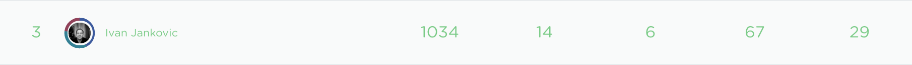

```
May                               ~ 12H
_______________________________________   

Ruby Basics                   - 169 min   
Ruby Collections              - 106 min   
Ruby Loops                    -  79 min   
Ruby Objects and Classes      - 121 min   
Ruby Blocks                   -  96 min   
Build an Address Book in Ruby - 109 min   
Ruby Gems                     -  48 min
_______________________________________

```

```
Jun                                ~ 3H
_______________________________________   

Introduction to Git           - 186 min
_______________________________________   

```

```
Jul                               ~ 15H
_______________________________________   

Git Branches and Merging      - 101 min   
GitHub Basics                 - 139 min   
Ruby Modules                  - 120 min   
Ruby Core & Standard Library  - 121 min   
Introduction to Algorithms    - 134 min   
Introduction Data Structures  - 163 min   
Algorithm Sorting & Searching - 119 min
_______________________________________ 

```

```
Aug                                ~ 7H
_______________________________________

The Landscape of JavaScript   -  44 min
The JavaScript Ecosystem      -  29 min
Introducing ES2015            - 112 min
HTTP Basics                   -  67 min
Node.js Basics                - 138 min
Getting Started w TypeScript  -  43 min
_______________________________________

```

```
Sep                                      ~ 8H
_____________________________________________

npm Basics                          -  76 min
Introduction to REST APIs           -  30 min

Simple Dynamic Site with Node.js    - 122 min
Express Basics                      - 247 min
Build a REST API With Express       - 221 min
_____________________________________________

```



```
10H to 20H per month is good if you are working onn something else at the same time, if not you should do at lower end 30H
```

NEXT  
`030` [Introduction to REST APIs](https://teamtreehouse.com/library/introduction-to-rest-apis)  
`...` [Node.js](https://teamtreehouse.com/library/type:course/q:node.js)  
`...` [React](https://teamtreehouse.com/library/type:course/q:React)  
`...` [Tracks](https://teamtreehouse.com/tracks)  
`234` [Python Basics](https://teamtreehouse.com/library/python-basics-3)   
`158` [Functional Python](https://teamtreehouse.com/library/functional-python)    
`070` [Write Better Python](https://teamtreehouse.com/library/write-better-python)    
`...` [Python](https://teamtreehouse.com/library/type:course/q:python)  

Ruby:  
[Ruby on Rails 5 Basics](https://teamtreehouse.com/library/ruby-on-rails-5-basics)  
[Ruby](https://teamtreehouse.com/library/type:course/q:ruby)  

Rest:  
[Asynchronous Programming with JavaScript](https://teamtreehouse.com/library/asynchronous-programming-with-javascript)  
[Prototyping with Adobe XD](https://teamtreehouse.com/library/prototyping-with-adobe-xd)  
[Design Systems](https://teamtreehouse.com/library/design-systems)  
[C# Basics](https://teamtreehouse.com/library/your-first-c-program)  